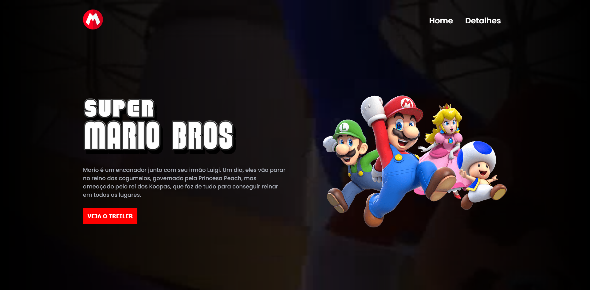

# Aula de GitHub 
          
          
__Curso Desenvolvedor Java - Senai 2023__

## Olá me chamo Lucas Leone ;D

> * Sou militar da __FAB__
> * Formado em ADS pela UDF em 2022

### Meu ultimo projeto foi esse
<a href="https://lcsleone.github.io/projeto-HTML/">Veja aqui</a>

## Linguagens ultilizadas

<code></code>
<code></code>
<code></code>

## Contato

  

  
